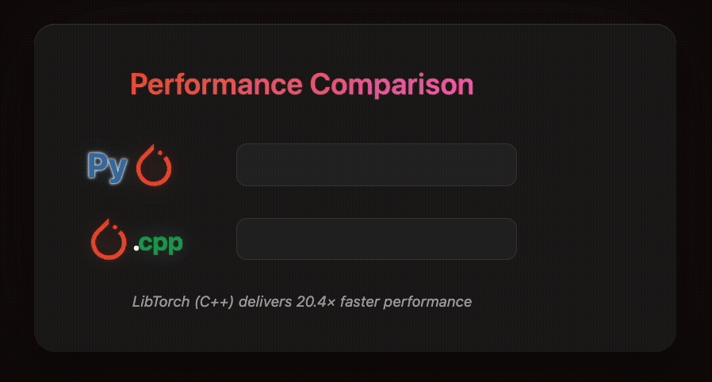

# Masked Autoencoder (MAE) - C++ Implementation

A high-performance PyTorch C++ implementation of Masked Autoencoder (MAE) for self-supervised visual representation learning, including both training and inference server capabilities.

## Overview

This project implements the Masked Autoencoder (MAE) architecture from the paper "Masked Autoencoders Are Scalable Vision Learners" using PyTorch C++ API (LibTorch). The implementation includes:

- Full MAE architecture with ViT-Base, ViT-Large, and ViT-Huge variants
- Optimized pretraining pipeline with gradient accumulation
- HTTP inference server for real-time image reconstruction
- Efficient data loading with OpenCV
- Mixed precision training support
- Comprehensive checkpoint management

## Features

### Training
- Support for all three MAE model variants (Base/Large/Huge)
- Cosine learning rate schedule with warmup
- AdamW optimizer with gradient clipping
- Automatic checkpoint saving and resuming
- Efficient data augmentation pipeline

### Inference Server
- Binary-only REST API (no base64 overhead)
- Three simple endpoints: mask, reconstruct, and combined
- Real-time image processing
- GPU acceleration support
- Request logging and monitoring

## Project Structure

```
MAE/
├── include/
│   ├── mae_model.hpp      # MAE model definition
│   └── data_loader.hpp    # Dataset and data loading utilities
├── src/
│   ├── mae_model.cpp      # MAE model implementation
│   ├── data_loader.cpp    # Dataset implementation
│   ├── train_mae.cpp      # Basic training script
│   ├── pretrain_mae.cpp   # Full pretraining pipeline
│   └── mae_server.cpp     # HTTP inference server
├── configs/               # Training configuration files
│   ├── mae_pretrain_vit_base.json
│   ├── mae_pretrain_vit_large.json
│   └── mae_pretrain_vit_base_test.json
├── docs/
│   ├── pytorch_cpp_setup.md   # PyTorch C++ installation guide
│   ├── dataset_setup.md        # Dataset preparation guide
│   ├── pretraining_guide.md    # Detailed pretraining instructions
│   └── mae_server_guide.md     # Server usage and API documentation
├── CMakeLists.txt         # CMake build configuration
└── README.md             # This file
```

## Requirements

- CMake 3.14+
- C++17 compatible compiler
- PyTorch C++ (LibTorch) 2.0+
- OpenCV 4.x
- CUDA 11.x or 12.x (for GPU support)
- cpp-httplib (for server)
- nlohmann/json 3.x

## Quick Start

### 1. Setup PyTorch C++

Follow the detailed guide in [`docs/pytorch_cpp_setup.md`](docs/pytorch_cpp_setup.md) to install LibTorch.

```bash
# Download LibTorch (example for CUDA 11.8)
wget https://download.pytorch.org/libtorch/cu118/libtorch-cxx11-abi-shared-with-deps-2.1.0%2Bcu118.zip
unzip libtorch-cxx11-abi-shared-with-deps-2.1.0+cu118.zip
```

### 2. Build the Project

```bash
mkdir build && cd build
cmake -DCMAKE_PREFIX_PATH=/path/to/libtorch ..
cmake --build . --config Release -j$(nproc)
```

### 3. Prepare Dataset

Follow [`docs/dataset_setup.md`](docs/dataset_setup.md) to prepare your dataset:

```
data/
└── train/
    ├── class1/
    │   ├── img1.jpg
    │   └── ...
    └── class2/
        ├── img1.jpg
        └── ...
```

## Pretraining Models

For full pretraining with proper configuration, see [`docs/pretraining_guide.md`](docs/pretraining_guide.md).

### Quick Pretrain

```bash
# Using configuration file (recommended)
./pretrain_mae configs/mae_pretrain_vit_base.json

# Test with smaller batch size
./pretrain_mae configs/mae_pretrain_vit_base_test.json
```

### Basic Training (Legacy)

```bash
./train_mae /path/to/data/train [batch_size] [epochs]

# Example
./train_mae ../data/imagenet/train 64 400
```

## Running the Inference Server

The MAE server provides a simple HTTP API for image reconstruction. See [`docs/mae_server_guide.md`](docs/mae_server_guide.md) for complete documentation.

### Start Server

```bash
./mae_server --checkpoint checkpoints/model.pt --model mae_vit_base_patch16 --port 8080
```

### API Endpoints

1. **POST /mask** - Create masked visualization
2. **POST /reconstruct** - Reconstruct image with MAE
3. **POST /mask_and_reconstruct** - Combined operation

All endpoints accept binary image data with optional headers:
- `X-Mask-Ratio`: Float between 0.0-1.0 (default: 0.75)
- `X-Output-Type`: For combined endpoint - "masked", "reconstructed", or "both"

### Example Usage

```bash
# Mask an image
curl -X POST http://localhost:8080/mask \
  --data-binary "@image.jpg" \
  --output masked.png

# Reconstruct an image
curl -X POST http://localhost:8080/reconstruct \
  -H "X-Mask-Ratio: 0.75" \
  --data-binary "@image.jpg" \
  --output reconstructed.png

# Get both outputs side by side
curl -X POST http://localhost:8080/mask_and_reconstruct \
  -H "X-Output-Type: both" \
  --data-binary "@image.jpg" \
  --output comparison.png
```

## Model Variants

| Model | Patches | Embed Dim | Heads | Layers | Params |
|-------|---------|-----------|-------|---------|---------|
| ViT-Base | 16x16 | 768 | 12 | 12 | 86M |
| ViT-Large | 16x16 | 1024 | 16 | 24 | 304M |
| ViT-Huge | 14x14 | 1280 | 16 | 32 | 632M |

## Memory Requirements

| Model | Batch Size | Resolution | Training VRAM | Inference VRAM |
|-------|------------|------------|---------------|----------------|
| ViT-Base | 64 | 224x224 | ~12GB | ~4GB |
| ViT-Base | 128 | 224x224 | ~20GB | ~4GB |
| ViT-Large | 32 | 224x224 | ~16GB | ~8GB |
| ViT-Large | 64 | 224x224 | ~24GB | ~8GB |

## Python Client Example

```python
import requests

def reconstruct_image(image_path, server="http://localhost:8080"):
    with open(image_path, 'rb') as f:
        response = requests.post(
            f"{server}/reconstruct",
            data=f.read(),
            headers={'X-Mask-Ratio': '0.75'}
        )
    
    if response.status_code == 200:
        with open("reconstructed.png", 'wb') as f:
            f.write(response.content)
```

## Performance Tips

1. **Training**:
   - Use the largest batch size that fits in memory
   - Enable gradient accumulation for larger effective batch sizes
   - Use fast storage (NVMe SSD) for dataset
   - Increase data loader workers

2. **Inference Server**:
   - Keep server running (first request loads model)
   - Use binary format (no base64 encoding)
   - Enable GPU for faster processing

## Extending the Code

### Adding New Models

Create new model variants in `mae_model.cpp`:

```cpp
MaskedAutoencoderViT mae_vit_custom(bool norm_pix_loss) {
    return MaskedAutoencoderViT(
        224,    // img_size
        16,     // patch_size
        3,      // in_chans
        768,    // embed_dim
        12,     // depth
        12,     // num_heads
        512,    // decoder_embed_dim
        8,      // decoder_depth
        16,     // decoder_num_heads
        4.,     // mlp_ratio
        norm_pix_loss
    );
}
```

## Documentation

- [PyTorch C++ Setup Guide](docs/pytorch_cpp_setup.md) - Installing LibTorch and dependencies
- [Dataset Setup Guide](docs/dataset_setup.md) - Preparing datasets for training
- [Pretraining Guide](docs/pretraining_guide.md) - Detailed pretraining instructions
- [Server Usage Guide](docs/mae_server_guide.md) - HTTP server API documentation

## Demo



## Citation

If you use this implementation, please cite the original MAE paper:

```bibtex
@article{he2022masked,
  title={Masked autoencoders are scalable vision learners},
  author={He, Kaiming and Chen, Xinlei and Xie, Saining and Li, Yanghao and Doll{\'a}r, Piotr and Girshick, Ross},
  journal={CVPR},
  year={2022}
}
```

## License

This implementation follows the license of the original MAE repository.